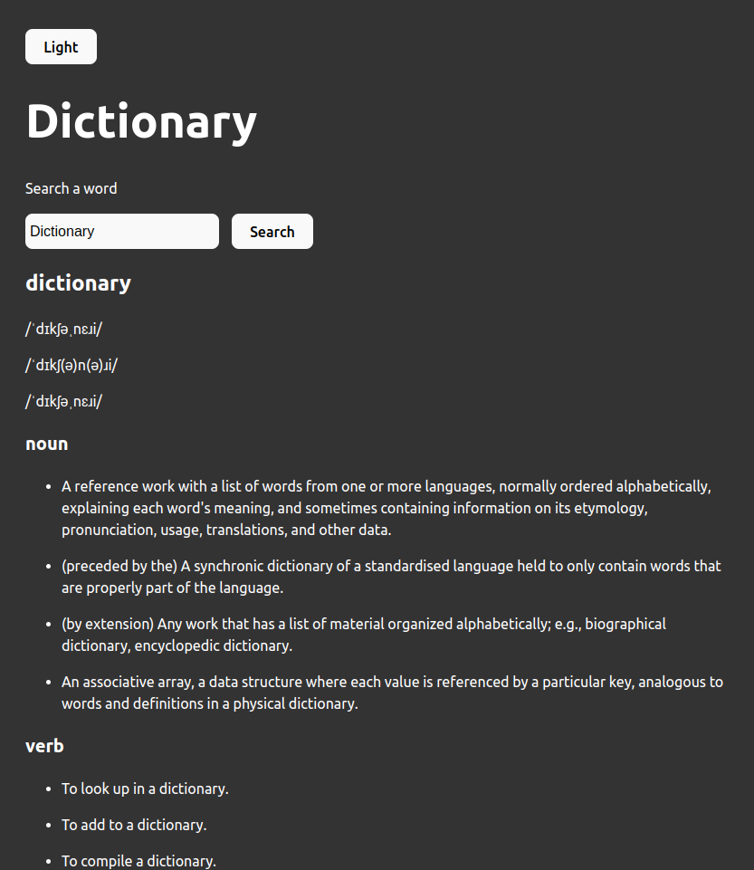
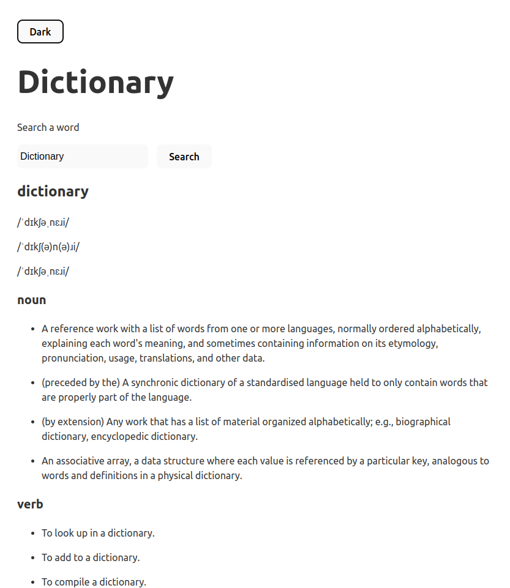

# Dictionary App

Dictionary is a practice App made with React, using the the [Free Dictionary API](https://dictionaryapi.dev/) to bring the data to the site. The objetive was to practice React and fetching API's data.-

You can try it on [DictionaryApp](https://react-dictionary-lyart.vercel.app/)

## Screenshots

## Author

- [Gonzalo Ferreyra](https://www.linkedin.com/in/ferreyragonzalo/)

